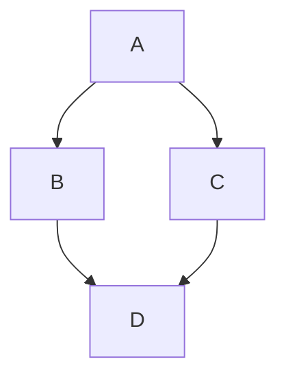
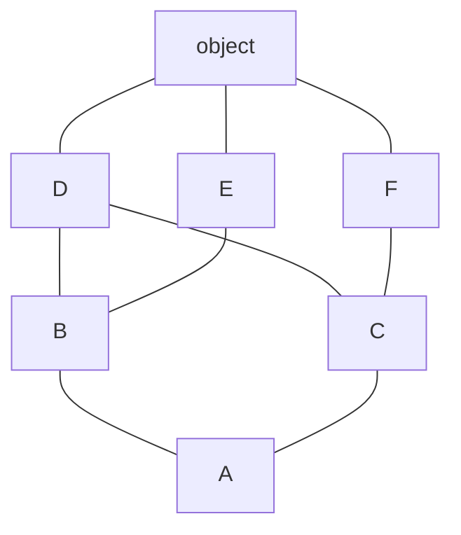

prthon 类是支持（多）继承的，一个类的方法和属性可能定义在当前类，也可能定义在基类。针对这种情况，当调用类方法或类属性时，就需要对当前类以及它的基类进行搜索，以确定方法或属性的位置，而搜索的顺序就称为方法解析顺序。

## 方法解析顺序（Method Resolution Order），简称 MRO

对于只支持单继承的编程语言来说，MRO 很简单，就是从当前类开始，逐个搜索它的父类；而对于 Python，它支持多继承，MRO 相对会复杂一些。

实际上，Python 发展至今，经历了以下 3 种 MRO 算法，分别是：

1. 从左往右，采用深度优先搜索（DFS）的算法，称为旧式类的 MRO；
2. 自 Python 2.2 版本开始，新式类在采用深度优先搜索算法的基础上，对其做了优化；
3. 自 Python 2.3 版本，对新式类采用了 C3 算法。由于 Python 3.x 仅支持新式类，所以该版本只使用 C3 算法。

为什么 MRO 弃用了前两种算法，而选择最终的 C3 算法呢？原因很简单，前 2 种算法都存在一定的问题。

## 旧式类 MRO 算法

在使用旧式类的 MRO 算法时，以下面代码为例:

```python
class A:
    def method(self):
        print("CommonA")
class B(A):
    pass
class C(A):
    def method(self):
        print("CommonC")
class D(B, C):
    pass

D().method()
```



通过分析可以想到，此程序中的 4 个类是一个“菱形”继承的关系，当使用 D 类对象访问 method() 方法时，根据深度优先算法，搜索顺序为 `D->B->A->C->A` 。

旧式类的 MRO 可通过使用 inspect 模块中的 getmro(类名) 函数直接获取。例如 `inspect.getmro(D)` 表示获取 D 类的 MRO。

因此，使用旧式类的 MRO 算法最先搜索得到的是基类 A 中的 method() 方法，即在 Python 2.x 版本中，此程序的运行结果为：

`CommonA`

但是，这个结果显然不是想要的，我们希望搜索到的是 C 类中的 method() 方法。

## 新式类 MRO 算法

为解决旧式类 MRO 算法存在的问题，Python 2.2 版本推出了新的计算新式类 MRO 的方法，它仍然采用从左至右的深度优先遍历，但是如果遍历中出现重复的类，只保留最后一个。

仍以上面程序为例，通过深度优先遍历，其搜索顺序为 `D->B->A->C->A` ，由于此顺序中有 2 个 A，因此仅保留后一个，简化后得到最终的搜索顺序为 `D->B->C->A` 。

新式类可以直接通过 `类名.__mro__ ` 的方式获取类的 MRO，也可以通过 `类名.mro()` 的形式，旧式类是没有 ` __mro__` 属性和 `mro() ` 方法的。

可以看到，这种 MRO 方式已经能够解决“菱形”继承的问题，但是可能会违反单调性原则。所谓单调性原则，是指在类存在多继承时，子类不能改变基类的 MRO 搜索顺序，否则会导致程序发生异常。

例如，分析如下程序：

```python
class X(object):
    pass
class Y(object):
    pass
class A(X,Y):
    pass
class B(Y,X):
    pass
class C(A, B):
    pass
```

通过进行深度遍历，得到搜索顺序为 `C->A->X->object->Y->object->B->Y->object->X->object` ，再进行简化（相同取后者），得到 `C->A->B->Y->X->object`

下面来分析这样的搜索顺序是否合理，我们来看下各个类中的 MRO：

- 对于 A，其搜索顺序为 A->X->Y->object；
- 对于 B，其搜索顺序为 B->Y->X->object；
- 对于 C，其搜索顺序为 C->A->B->X->Y->object。

可以看到，B 和 C 中，X、Y 的搜索顺序是相反的，也就是说，当 B 被继承时，它本身的搜索顺序发生了改变，这违反了单调性原则。

## MRO C3

为解决 Python 2.2 中 MRO 所存在的问题，Python 2.3 采用了 C3 方法来确定方法解析顺序。多数情况下，如果某人提到 Python 中的 MRO，指的都是 C3 算法。那么，C3 算法是怎样实现的呢？

在开始之前先介绍几个简单符号。

1. $C_1C_2 \cdots C_n$
   表示类列表 $\{C_1C_2 \cdots C_n\}$
   列表的首元素 $Head = C_1$
   其余元素为尾 $Tail = C_2\cdots C_n$
2. $C + (C_{1}C_{2}\dots C_{n})$
   表示 $\{C\}+\{C_{1}C_{2}\dots C_{n}\}$ 列表的和

考虑多继承层次结构中的类 C，其中 C 继承自基类 $B_{1}$、$B_{2}$、…、$B_{n}$。我们要计算 C 类的线性化 $\mathcal{L} [C]$。规则如下：

C 的线性化是 C 加上父元素的线性化和父元素列表的合并的和

**用符号表示法中**：

$$
	\mathcal{L}[C(B_{1}B_{2}\dots B_{n})] = C +merge\left( \sum_{i=1}^{N} \mathcal{L}[B_{i}] \right)
$$

特别是，如果 C 是没有父类的对象类，那么线性化就很简单了

在这里 merge 的运算方式如下：

1. 检查第一个列表的头元素（如 $\mathcal{L}[B]$ 的头），记作 $H$。
2. 若 $H$ 未出现在 merge 中其它列表的尾部，则将其输出，并将其从所有列表中删除，然后回到步骤 1；否则，取出下一个列表的头部记作 $H$，继续该步骤。

重复上述步骤，直至列表为空或者不能再找出可以输出的元素。如果是前一种情况，则算法结束；如果是后一种情况，Python 会抛出异常。

以下面程序为主，C3 把各个类的 MRO 记为如下等式：

```python
class A:
    def method(self):
        print("CommonA")
class B(A):
    pass
class C(A):
    def method(self):
        print("CommonC")
class D(B, C):
    pass

D().method()
```

由此，可以计算出类 B 的 MRO，其计算过程为：

$\begin{aligned} L[B]   &= [B] + merge(L[A],[A]) \\ &= [B] + merge([A,object],[A])\\ &= [B,A] + merge([object])         \\ &= [B,A,object] \end{aligned}$

$\begin{aligned} L[C]&= [C] + merge(L[A] , [A]) \\ &=[C]+merge([A,object],[A])\\ &=[C,A]+merge([object])\\ &=[C,A,object] \end{aligned}$

$\begin{aligned} L[D]& = [D] + merge(L[B] , L[C] , [B] , [C])\\ &=[D]+merge([B,A,object],[C,A,object],[B],[C])\\ &=[D,B]+merge([A,object],[C,A,object],[C])\\ &=[D,B,C]+merge([A,object],[A,object])\\ &=[D,B,C,A]+merge([object])\\ &=[D,B,C,A,object] \end{aligned}$

程序运行结果为：

```
CommonC
[<class '__main__.D'>, <class '__main__.B'>, <class '__main__.C'>,
 <class '__main__.A'>, <class 'object'>]
```

同理，对以下程序进行分析。

```python
class X(object):
    pass
class Y(object):
    pass
class A(X,Y):
    pass
class B(Y,X):
    pass
class C(A, B):
    pass
```

object，X，Y 的线性化结果比较简单：

A 的线性化计算如下：

$\begin{aligned} L[A]  &= [A] + merge(L[X], L[Y], [X], [Y])\\ &= [A] + merge([X, object], [Y, object], [X], [Y])\\ &= [A，X] + merge([object], [Y, object], [Y])\\ &  = [A,，X，Y] + merge([object], [object])\\ & = [A，X，Y，object] \end{aligned}$

注意第 3 步，merge(\[object\], \[Y, object\], \[Y\]) 中首先输出的是 Y 而不是 object。这是因为 object 虽然是第一个列表的头，但是它出现在了第二个列表的尾部。所以我们会跳过第一个列表，去检查第二个列表的头部，也就是 Y。Y 没有出现在其它列表的尾部，所以将其输出。
同理，B 的线性化结果为：

最后，我们看看 C 的线性化结果：

$\begin{aligned} L[C] &= [C] + merge(L[A], L[B], [A], [B])\\     & = [C] + merge([A, X, Y, object], [B ，Y ，X， object], [A], [B])\\      &= [C, A] + merge([X, Y, object], [B， Y， X， object], [B])\\     & = [C, A, B] + merge([X, Y, object], [Y，X， object]) \end{aligned}$

到了最后一步我们没有办法继续计算下去 了：X 虽然是第一个列表的头，但是它出现在了第二个列表的尾部；Y 虽然是第二个列表的头，但是它出现在了第一个列表的尾部。所以在 python2.3 之后的版本运行上面程序会报错：

```
TypeError: Cannot create a consistent method resolution
order (MRO) for bases X, Y
```

因此，我们无法构建一个没有二义性的继承关系，只能手工去解决（比如改变 B 基类中 X、Y 的顺序）。

从以上两个例子可以看出，C3 可以有效解决前面 2 种算法的问题

下面我们看一个复杂的继承关系如下：



代码如下：

```python
class D: pass
class E: pass
class F: pass
class B(D,E):pass
class C(D,F):pass
class A(B,C):pass

print(A.mro())

#(<class '__main__.A'>, <class '__main__.B'>, <class '__main__.C'>,
# <class '__main__.D'>, <class '__main__.E'>, <class '__main__.F'>, <class 'object'>)
```

计算过程如下：

$$
\begin{aligned} L[object] &= [object]\\ L[D] &= [D, object]\\ L[E] &= [E, object]\\ L[F]& = [F, object]\\ L[B]& = [B, D, E, object]\\ L[C]& = [C, D, F, object]\\ L[A] &= [A] + merge(L[B], L[C], [B], [C])\\      &= [A] + merge([B, D, E, object], [C，D，F， object], [B], [C])\\      &= [A, B] + merge([D, E, object], [C， D，F，object], [C])\\      &= [A, B, C] + merge([D, E, object], [D， F， object])\\      &= [A, B, C, D] + merge([E, object], [F, object])\\      &= [A, B, C, D, E] + merge([object], [F, object])\\      &= [A, B, C, D, E, F] + merge([object], [object])\\      &= [A, B, C, D, E, F, object] \end{aligned}
$$